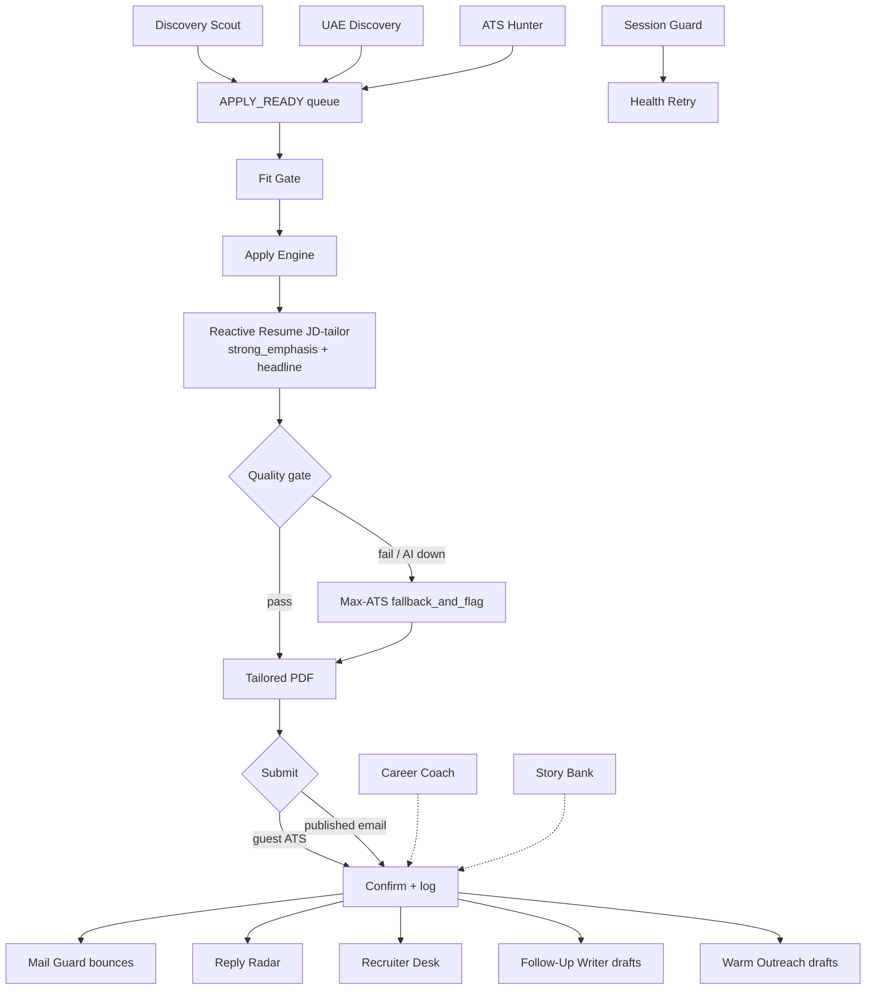

# HireMesh

**Multi-worker agentic job-search + auto-apply pipeline** for serious Cloud / Platform / AI leadership searches.

HireMesh runs fifteen independent workers that share files (queues, status, inbox). They do **not** wait on each other: each wakes on its schedule, reads the latest artifacts, does one job, writes status, and exits. Originally built as scheduled routines on the [Grok Bot](https://grok.com) desktop-assistant platform; this repo also ships Claude and ChatGPT / OpenAI Agents SDK ports.

Author: **Meet Shah** · Portfolio: [shahmeetk.github.io](https://shahmeetk.github.io) · Repo: [github.com/shahmeetk/HireMesh](https://github.com/shahmeetk/HireMesh)

## Why

Volume engines spray applications. HireMesh optimizes for **fit-first discovery**, **JD-tailored resumes**, **published-email-only outreach**, and **interview conversion** (follow-ups, warm notes, reply tracking) — with humans still clicking Send on every outbound message that isn't a confirmable ATS form.

## Flow



### Diagrams


## Workers (15)

| Bot | Purpose | Schedule (Asia/Dubai) | Reads | Writes | Mode |
|-----|---------|----------------------|-------|--------|------|
| **Discovery Scout** | Free-API + portal discovery; rank fit/geo into APPLY_READY | :11 every 2h | excludes, SALARY_POLICY, portals | queues/SCOUT_QUEUE.json, queues/APPLY_READY.json, status/MESH_STATUS.json | discover-only |
| **UAE Discovery** | Daytime Bayt/GulfTalent/GCC careers → APPLY_READY lane=uae | 08:56–16:56 / 2h | excludes, lane_router | queues/APPLY_READY.json (lane=uae) | discover-only |
| **ATS Hunter** | Guest Greenhouse/Lever/Workable/Ashby closer | :41 every 2h | APPLY_READY (guest_ats first), APPLIED_* | status/HUNTER_RESULTS.json, APPLIED_* | acting (guest ATS) |
| **Fit Gate** | Local BM25+seniority+lane re-rank; drop weak rows | :18 every 2h | SCOUT_QUEUE / APPLY_READY, FIT_GATE.json | APPLY_READY.json, status/FIT_GATE_DROPPED_LAST.json | rank-only |
| **Apply Engine** | JD-tailor via Reactive Resume → quality gate → ATS or published-email submit | :26 every 2h | APPLY_READY, EMAIL_SAFE, master resume | APPLIED_*, APPLY_LOG, tailored PDFs, TAILOR_FALLBACK_RETRY.jsonl | acting (ATS/email) |
| **Mail Guard** | Bounce harvest + published hiring-email verify | 08:56 / 14:56 / 20:56 | Gmail DSNs, careers pages | status/BOUNCES.json, queues/EMAIL_SAFE.json | verify-only |
| **Recruiter Desk** | Inbound recruiter triage → reply drafts | weekdays 09:26 / 13:26 / 17:26 | Gmail recruiter threads | inbox/RECRUITER_DRAFTS.md | draft-only |
| **Career Coach** | Weekly quality/quantity + conversion digest | Mondays 08:26 | APPLY_LOG, FUNNEL, blockers | status/WEEKLY_COACH.md | read-only |
| **Follow-Up Writer** | D+3/D+7/D+14 nudge drafts after applies | daily 10:53 | APPLY_LOG, FUNNEL | inbox/FOLLOWUPS.md | draft-only |
| **Warm Outreach** | HM/recruiter note drafts for strong fits | weekdays 12:26 | APPLY_LOG, APPLY_READY | inbox/WARM_PATH.md | draft-only |
| **Reply Radar** | Gmail replies → FUNNEL stages; alert on screens | 11:53 / 16:53 / 20:53 | Gmail | status/FUNNEL.json | classify-only |
| **Story Bank** | Weekly STAR bank refresh from resume + JD themes | Sundays 18:26 | master resume, recent JDs | status/STORY_BANK.md | prep-only |
| **Session Guard** | Probe Gmail, LinkedIn, Reactive Resume AI | 08:36 / 14:36 / 20:36 | sessions / RXRESU | status/SESSION_GUARD.json, HEALTH_RETRY_NEEDED.json | health-only |
| **Reactive Resume AI Watch** | Probe Reactive Resume AI; write RXRESU_AI_STATUS.json | folded into Session Guard (optional standalone) | RXRESU API | status/RXRESU_AI_STATUS.json | health-only |
| **Health Retry** | Dense rechecks until Session Guard is healthy; then idle | :23/:53 08–21 (only when unhealthy) | HEALTH_RETRY_NEEDED.json | status/HEALTH_RETRY_LAST.json | health-only |

## Key design rules

1. **Lane routing** — UAE-based **or** fully remote, never both as one target. Daytime (≈08:00–17:59 local) prioritizes UAE; evening/night prioritizes fully remote. Soft-geo EMEA remote = remote lane.
2. **Fit-first** — Fit Gate demotes weak inquiry spam before Apply Engine spends a cycle.
3. **Never re-apply** the same company or URL (`APPLIED_COMPANIES.txt` / `APPLIED_URLS.txt`).
4. **Published hiring emails only** — Mail Guard verifies; never invent `hello@` / `careers@`.
5. **Never auto-send replies** — Follow-Up Writer, Warm Outreach, and Recruiter Desk are draft-only.
6. **Blockers go to a backlog** — CAPTCHA / SSO / pixel issues are logged; Scout/Engine/Hunter keep moving.
7. **Health checks at set hours** — Session Guard at 08:36 / 14:36 / 20:36; Health Retry densifies only while unhealthy.

## Quick Start

### Grok Bot
1. Copy `platforms/grokbot/skills/` into your skills library and `platforms/grokbot/routines/` as scheduled routines.
2. Set `HIREMESH_HOME` to a writable workspace folder; copy `config/*.example.*` → live config; fill `.env`.
3. Enable schedules (Asia/Dubai examples in each routine). See [`platforms/grokbot/README.md`](platforms/grokbot/README.md).

### Claude
1. Copy `platforms/claude/.claude/` into your project; install Agent Skills under `platforms/claude/skills/`.
2. Connect filesystem + browser (e.g. Playwright MCP) + Gmail MCP.
3. Schedule with `claude -p` + cron/launchd. See [`platforms/claude/README.md`](platforms/claude/README.md).

### ChatGPT / OpenAI
1. Custom GPT: paste `platforms/chatgpt/custom-gpt/instructions.md` (under 8k chars) and attach knowledge files listed there.
2. Or run `platforms/chatgpt/agents-sdk/` with `openai-agents` + cron. See [`platforms/chatgpt/agents-sdk/README.md`](platforms/chatgpt/agents-sdk/README.md).

### Plain cron + Python
```bash
export HIREMESH_HOME=/path/to/hiremesh-data
cp -r config examples "$HIREMESH_HOME/"
pip install -r requirements.txt   # stdlib-only for most scripts; urllib only
python scripts/job_scout_hire_mesh.py
python scripts/fit_gate_hire_mesh.py
python scripts/jd_tailor_resume.py --company Acme --role "Platform Lead" --jd-file jd.txt
```

## Repo layout

```
HireMesh/
├── README.md
├── docs/               architecture, getting-started, jd-tailoring, bots/*, images/
├── platforms/
│   ├── grokbot/        original routines + skills (reconstructed)
│   ├── claude/         subagents, Agent Skills, slash commands
│   └── chatgpt/        Custom GPT instructions + Agents SDK example
├── scripts/            Python helpers (env-based paths, no secrets)
├── config/             example candidate / roles / lanes / excludes
├── examples/           fake JSON artifacts
├── .env.example
└── LICENSE             MIT
```


---

## Full documentation

Everything below is also kept as separate files under [`docs/`](docs/).

### Architecture

### Architecture

HireMesh is a **shared-filesystem multi-worker** system. Workers are scheduled independently and coordinate only through files under `$HIREMESH_HOME`.

#### Shared files

| Artifact | Path | Writer(s) | Readers |
|----------|------|-----------|---------|
| Scout queue | `queues/SCOUT_QUEUE.json` | Discovery Scout | Fit Gate |
| Apply-ready | `queues/APPLY_READY.json` | Scout, UAE Discovery, Fit Gate | Apply Engine, ATS Hunter, Warm Outreach |
| Email-safe | `queues/EMAIL_SAFE.json` | Mail Guard | Apply Engine |
| Applied ledger | `APPLIED_COMPANIES.txt`, `APPLIED_URLS.txt` | Engine, Hunter | everyone (dedupe) |
| Fit config | `status/FIT_GATE.json` | human / Coach | Fit Gate |
| Mesh heartbeat | `status/MESH_STATUS.json` | every worker | status dashboards |
| Funnel | `status/FUNNEL.json` | Reply Radar, Follow-Up Writer | Career Coach |
| Bounces | `status/BOUNCES.json` | Mail Guard | Engine |
| Session health | `status/SESSION_GUARD.json` | Session Guard | Health Retry |
| AI probe | `status/RXRESU_AI_STATUS.json` | Reactive Resume AI Watch | Session Guard, Engine |
| Tailor retry log | `status/TAILOR_FALLBACK_RETRY.jsonl` | Apply Engine | Coach / human |
| Follow-ups | `inbox/FOLLOWUPS.md` | Follow-Up Writer | human |
| Warm path | `inbox/WARM_PATH.md` | Warm Outreach | human |
| Recruiter drafts | `inbox/RECRUITER_DRAFTS.md` | Recruiter Desk | human |
| Story bank | `status/STORY_BANK.md` | Story Bank | human |
| Weekly coach | `status/WEEKLY_COACH.md` | Career Coach | human |
| Blocker backlog | `status/BLOCKER_BACKLOG.md` | Engine / Hunter | human (async) |

#### Handoff protocol

1. **Discover** — Scout (remote APIs + portals) and UAE Discovery (daytime UAE boards) append candidates.
2. **Gate** — Fit Gate re-ranks / drops; writes clean `APPLY_READY.json`.
3. **Apply** — Apply Engine JD-tailors (Reactive Resume `strong_emphasis`) and submits; ATS Hunter prefers guest ATS on the same ledger.
4. **Guard** — Mail Guard repairs bounce addresses into `EMAIL_SAFE.json`.
5. **Convert** — Reply Radar stages inbound mail; Follow-Up / Warm / Recruiter Desk draft only.
6. **Coach** — Monday digest + Sunday Story Bank.
7. **Health** — Session Guard at fixed hours; Health Retry densifies only on failure.

Workers update `status/MESH_STATUS.json` with `{worker, ts, ok, notes}` each run.

#### Schedule overview (cron, Asia/Dubai example)

Timezone is configurable via `TZ` / `HIREMESH_TZ` (default `Asia/Dubai`).

| Cron (Asia/Dubai) | Worker |
|-------------------|--------|
| `11 */2 * * *` | Discovery Scout |
| `18 */2 * * *` | Fit Gate |
| `26 */2 * * *` | Apply Engine |
| `41 */2 * * *` | ATS Hunter |
| `56 8,14,20 * * *` | Mail Guard |
| `26 9,13,17 * * 1-5` | Recruiter Desk |
| `26 8 * * 1` | Career Coach |
| `56 8-16/2 * * *` | UAE Discovery |
| `53 10 * * *` | Follow-Up Writer |
| `53 11,16,20 * * *` | Reply Radar |
| `26 12 * * 1-5` | Warm Outreach |
| `26 18 * * 0` | Story Bank |
| `36 8,14,20 * * *` | Session Guard |
| `23,53 8-21 * * *` | Health Retry (no-ops when healthy) |

#### Quiet unless worth surfacing

Workers stay silent when there's nothing actionable:

- Scout with zero new fit → heartbeat only.
- Reply Radar with no screen/interview → no ping.
- Session Guard healthy → no notification; Health Retry skips.
- Draft workers write files; they never spam chat unless a screen/offer appears.

#### Diagrams


### Getting started

### Getting started

#### Prerequisites

- Python 3.10+ (stdlib is enough for most scripts; `urllib` only)
- A writable data dir (`HIREMESH_HOME`) for queues/status/inbox/ledgers
- Optional: Reactive Resume (self-hosted or cloud) for JD tailoring
- Optional: Gmail + browser session for Mail Guard / Reply Radar / Recruiter Desk
- Optional: LinkedIn signed-in browser session for discovery (never Easy Apply)

#### Configure the candidate

```bash
export HIREMESH_HOME=~/hiremesh-data
mkdir -p "$HIREMESH_HOME"/{queues,status,inbox,tailored,scripts}
cp config/candidate.example.yaml "$HIREMESH_HOME/config/candidate.yaml"
cp config/roles.example.yaml "$HIREMESH_HOME/config/roles.yaml"
cp config/lanes.example.yaml "$HIREMESH_HOME/config/lanes.yaml"
cp config/exclude_companies.example.txt "$HIREMESH_HOME/exclude_companies.txt"
cp .env.example "$HIREMESH_HOME/.env"
### place your master resume PDF
cp /path/to/master.pdf "$HIREMESH_HOME/config/master_resume.pdf"
```

Edit `candidate.yaml`: name, email, phone, LinkedIn, target cities, work authorization notes.

##### Master resume

Point `RXRESU_MASTER_RESUME_ID` / `HIREMESH_MASTER_PDF` at your Max-ATS (or equivalent) master. Apply Engine clones + JD-tailors per role; on AI/gate failure it falls back to this PDF and flags the run.

##### Target role families

Default families (edit `roles.yaml`):

1. Cloud / Solutions / multi-cloud / FinOps
2. Platform / SRE / DevOps / DevSecOps
3. AIOps / Observability / Cloud Ops
4. AI / MLOps / LLMOps / AI Infra
5. Leadership overlays (EM / Head / Director / AVP / Principal / Staff)

##### Geo lanes

See `lanes.example.yaml`. Day = UAE queue; night = remote queue. Soft-geo EMEA remote counts as remote.

##### Exclude lists

`exclude_companies.example.txt` + runtime `APPLIED_COMPANIES.txt` / `APPLIED_URLS.txt` (gitignored).

##### Environment

See [`.env.example`](.env.example). Never commit real keys.

#### Run on each platform

##### (a) Grok Bot routines

Import skills + routines from `platforms/grokbot/`. Schedule per `docs/architecture.md`. Routines are **reconstructed** from the live mesh (original scheduler prompts were platform-private).

##### (b) Claude

See `platforms/claude/README.md`. Use subagents under `.claude/agents/`, skills under `skills/`, and slash commands. Schedule with:

```bash
claude -p "/hiremesh-scout" --allowedTools "Read,Write,Bash,mcp__filesystem__*,mcp__playwright__*"
```

##### (c) ChatGPT / OpenAI

- Custom GPT: `platforms/chatgpt/custom-gpt/instructions.md`
- Agents SDK: `platforms/chatgpt/agents-sdk/` (`pip install openai-agents`)

##### (d) Plain cron + Python

```cron
HIREMESH_HOME=/data/hiremesh
TZ=Asia/Dubai
11 */2 * * * cd /opt/HireMesh && python3 scripts/job_scout_hire_mesh.py
18 */2 * * * cd /opt/HireMesh && python3 scripts/fit_gate_hire_mesh.py
26 */2 * * * cd /opt/HireMesh && python3 scripts/mesh_status.py --worker apply_engine --ok --notes "drive via agent"
```

Browser/Gmail steps still need an agent or your own automation; scripts handle ranking, tailoring API calls, and file handoffs.

### JD tailoring

### JD tailoring

Owned by **Apply Engine** on every confirmable apply.

#### Pipeline

1. Pull JD → score fit
2. Call Reactive Resume API (`scripts/jd_tailor_resume.py`) with depth **`strong_emphasis`**
3. Post-align via `scripts/jd_strong_emphasis_align.py`
4. Quality gate
5. Export tailored PDF **or** Max-ATS fallback
6. Submit ATS / published-email PDF
7. Log application

#### `strong_emphasis` depth

- Keep facts true — **no invented** employers, titles, dates, or metrics
- Rewrite summary toward JD keywords
- Reorder + lightly rephrase experience bullets (HTML `description` `<ul><li><p>…`, not only `highlights`)
- Reorder / prioritize skills toward JD

#### `retarget_headline`

Change `basics.headline` (and resume display name) to match the target role, e.g. `Platform Engineering Lead — {{CANDIDATE_NAME}}`.

#### Quality gate

Before `tailored: true` / `experienceAligned: true`, require that **summary AND experience HTML AND skills** each differ from the Max-ATS master. If any is byte-identical → treat as shallow.

#### `fallback_and_flag`

If Reactive Resume AI is down (502/timeout) **or** the quality gate fails:

1. Use Max-ATS master PDF (`HIREMESH_MASTER_PDF`)
2. Set flags: `aiDown` / `tailorShallow` / `fallbackUsed` in the tailor sidecar JSON
3. Append a line to `status/TAILOR_FALLBACK_RETRY.jsonl`
4. **Continue** the apply — do not block the cycle

##### Retry log (example)

```json
{"ts":"2026-09-25T08:26:11+04:00","company":"ExampleCorp","role":"AI Platform Lead","reason":"quality_gate","flags":{"tailorShallow":true,"fallbackUsed":true}}
{"ts":"2026-09-25T10:26:04+04:00","company":"DemoAI","role":"Staff SRE","reason":"ai_502","flags":{"aiDown":true,"fallbackUsed":true}}
```

Re-tailor later when Session Guard / Reactive Resume AI Watch reports healthy.

### Bot guides

### Apply Engine

#### Use case

JD-tailor via Reactive Resume → quality gate → ATS or published-email submit

**Mode:** acting (ATS/email)  
**Schedule (Asia/Dubai example):** :26 every 2h  
**Helper script:** `scripts/jd_tailor_resume.py`

#### Worked example

**Input:** Top APPLY_READY row: ExampleCorp / Platform Lead

**Steps:**
1) JD tailor strong_emphasis
2) Quality gate
3) Export PDF
4) Guest ATS or EMAIL_SAFE PDF
5) Log

**Output artifact:** `tailored PDF + APPLIED_* + sidecar flags`

**Sample brief message:**
> Engine: ExampleCorp submitted (tailored). 1 fallback_and_flag (AI 502).

*(All company names and contacts in examples are fake.)*

#### Schedule

`:26 every 2h` — override via your platform scheduler / cron. Timezone: `HIREMESH_TZ` (default `Asia/Dubai`).

#### Reads / writes

| Direction | Artifacts |
|-----------|-----------|
| Reads | APPLY_READY, EMAIL_SAFE, master resume |
| Writes | APPLIED_*, APPLY_LOG, tailored PDFs, TAILOR_FALLBACK_RETRY.jsonl |

#### Safety rules

- Respect site ToS and rate limits
- No invented emails or resume facts
- Update MESH_STATUS heartbeat every run
- Never pause sibling workers on blockers
- Mode enforcement: **acting (ATS/email)** — do not exceed this lane

#### Failure modes & recovery

| Failure | Recovery |
|---------|----------|
| Empty upstream queue | Heartbeat + exit quiet |
| Auth / SSO / CAPTCHA | Log `status/BLOCKER_BACKLOG.md`; continue other jobs |
| API 5xx / timeout | Retry once; flag and move on |
| Deduped company/URL | Skip silently |
| Downstream consumer missing | Still write artifacts; siblings pick up next tick |

### ATS Hunter

#### Use case

Guest Greenhouse/Lever/Workable/Ashby closer

**Mode:** acting (guest ATS)  
**Schedule (Asia/Dubai example):** :41 every 2h  
**Helper script:** `scripts/ats_hunter.py`

#### Worked example

**Input:** APPLY_READY guest_ats=true

**Steps:**
1) Prefer Greenhouse/Lever/Workable guest forms
2) Submit confirmable applications
3) Ledger company+URL

**Output artifact:** `status/HUNTER_RESULTS.json`

**Sample brief message:**
> Hunter: 3 guest confirms, 2 blockers → backlog.

*(All company names and contacts in examples are fake.)*

#### Schedule

`:41 every 2h` — override via your platform scheduler / cron. Timezone: `HIREMESH_TZ` (default `Asia/Dubai`).

#### Reads / writes

| Direction | Artifacts |
|-----------|-----------|
| Reads | APPLY_READY (guest_ats first), APPLIED_* |
| Writes | status/HUNTER_RESULTS.json, APPLIED_* |

#### Safety rules

- Respect site ToS and rate limits
- No invented emails or resume facts
- Update MESH_STATUS heartbeat every run
- Never pause sibling workers on blockers
- Mode enforcement: **acting (guest ATS)** — do not exceed this lane

#### Failure modes & recovery

| Failure | Recovery |
|---------|----------|
| Empty upstream queue | Heartbeat + exit quiet |
| Auth / SSO / CAPTCHA | Log `status/BLOCKER_BACKLOG.md`; continue other jobs |
| API 5xx / timeout | Retry once; flag and move on |
| Deduped company/URL | Skip silently |
| Downstream consumer missing | Still write artifacts; siblings pick up next tick |

### Career Coach

#### Use case

Weekly quality/quantity + conversion digest

**Mode:** read-only  
**Schedule (Asia/Dubai example):** Mondays 08:26  
**Helper script:** `scripts/career_coach.py`

#### Worked example

**Input:** Week of APPLY_LOG + FUNNEL

**Steps:**
1) Tally volume + funnel
2) Recommend fit/follow-up actions

**Output artifact:** `status/WEEKLY_COACH.md`

**Sample brief message:**
> Coach: 37 applies, 4 replies, 1 screen. Send 6 follow-up drafts.

*(All company names and contacts in examples are fake.)*

#### Schedule

`Mondays 08:26` — override via your platform scheduler / cron. Timezone: `HIREMESH_TZ` (default `Asia/Dubai`).

#### Reads / writes

| Direction | Artifacts |
|-----------|-----------|
| Reads | APPLY_LOG, FUNNEL, blockers |
| Writes | status/WEEKLY_COACH.md |

#### Safety rules

- Respect site ToS and rate limits
- No invented emails or resume facts
- Update MESH_STATUS heartbeat every run
- Never pause sibling workers on blockers
- Mode enforcement: **read-only** — do not exceed this lane

#### Failure modes & recovery

| Failure | Recovery |
|---------|----------|
| Empty upstream queue | Heartbeat + exit quiet |
| Auth / SSO / CAPTCHA | Log `status/BLOCKER_BACKLOG.md`; continue other jobs |
| API 5xx / timeout | Retry once; flag and move on |
| Deduped company/URL | Skip silently |
| Downstream consumer missing | Still write artifacts; siblings pick up next tick |

### Discovery Scout

#### Use case

Free-API + portal discovery; rank fit/geo into APPLY_READY

**Mode:** discover-only  
**Schedule (Asia/Dubai example):** :11 every 2h  
**Helper script:** `scripts/job_scout_hire_mesh.py`

#### Worked example

**Input:** Empty or stale APPLY_READY; excludes loaded

**Steps:**
1) Fetch Remotive/RemoteOK/Himalayas/Arbeitnow/GH boards
2) Classify lane (UAE vs remote) by time of day
3) Dedupe APPLIED_*
4) Write SCOUT_QUEUE + APPLY_READY

**Output artifact:** `queues/APPLY_READY.json with ~N ranked jobs`

**Sample brief message:**
> Scout: +42 apply_ready (28 remote / 14 uae), guest_ats=19. Quiet otherwise.

*(All company names and contacts in examples are fake.)*

#### Schedule

`:11 every 2h` — override via your platform scheduler / cron. Timezone: `HIREMESH_TZ` (default `Asia/Dubai`).

#### Reads / writes

| Direction | Artifacts |
|-----------|-----------|
| Reads | excludes, SALARY_POLICY, portals |
| Writes | queues/SCOUT_QUEUE.json, queues/APPLY_READY.json, status/MESH_STATUS.json |

#### Safety rules

- Respect site ToS and rate limits
- No invented emails or resume facts
- Update MESH_STATUS heartbeat every run
- Never pause sibling workers on blockers
- Mode enforcement: **discover-only** — do not exceed this lane

#### Failure modes & recovery

| Failure | Recovery |
|---------|----------|
| Empty upstream queue | Heartbeat + exit quiet |
| Auth / SSO / CAPTCHA | Log `status/BLOCKER_BACKLOG.md`; continue other jobs |
| API 5xx / timeout | Retry once; flag and move on |
| Deduped company/URL | Skip silently |
| Downstream consumer missing | Still write artifacts; siblings pick up next tick |

### Fit Gate

#### Use case

Local BM25+seniority+lane re-rank; drop weak rows

**Mode:** rank-only  
**Schedule (Asia/Dubai example):** :18 every 2h  
**Helper script:** `scripts/fit_gate_hire_mesh.py`

#### Worked example

**Input:** SCOUT_QUEUE / noisy APPLY_READY

**Steps:**
1) BM25 + title family + seniority
2) Exclusive lane check
3) Drop below min score

**Output artifact:** `trimmed APPLY_READY + FIT_GATE_DROPPED_LAST.json`

**Sample brief message:**
> Fit Gate: kept 86 / dropped 54 (inquiry spam, junior).

*(All company names and contacts in examples are fake.)*

#### Schedule

`:18 every 2h` — override via your platform scheduler / cron. Timezone: `HIREMESH_TZ` (default `Asia/Dubai`).

#### Reads / writes

| Direction | Artifacts |
|-----------|-----------|
| Reads | SCOUT_QUEUE / APPLY_READY, FIT_GATE.json |
| Writes | APPLY_READY.json, status/FIT_GATE_DROPPED_LAST.json |

#### Safety rules

- Respect site ToS and rate limits
- No invented emails or resume facts
- Update MESH_STATUS heartbeat every run
- Never pause sibling workers on blockers
- Mode enforcement: **rank-only** — do not exceed this lane

#### Failure modes & recovery

| Failure | Recovery |
|---------|----------|
| Empty upstream queue | Heartbeat + exit quiet |
| Auth / SSO / CAPTCHA | Log `status/BLOCKER_BACKLOG.md`; continue other jobs |
| API 5xx / timeout | Retry once; flag and move on |
| Deduped company/URL | Skip silently |
| Downstream consumer missing | Still write artifacts; siblings pick up next tick |

### Follow-Up Writer

#### Use case

D+3/D+7/D+14 nudge drafts after applies

**Mode:** draft-only  
**Schedule (Asia/Dubai example):** daily 10:53  
**Helper script:** `scripts/follow_up_writer.py`

#### Worked example

**Input:** Applies aged ≥3/7/14 days

**Steps:**
1) Scan ledger ages
2) Draft D+3/D+7/D+14 notes

**Output artifact:** `inbox/FOLLOWUPS.md`

**Sample brief message:**
> Follow-Ups: 5 drafts written (human send).

*(All company names and contacts in examples are fake.)*

#### Schedule

`daily 10:53` — override via your platform scheduler / cron. Timezone: `HIREMESH_TZ` (default `Asia/Dubai`).

#### Reads / writes

| Direction | Artifacts |
|-----------|-----------|
| Reads | APPLY_LOG, FUNNEL |
| Writes | inbox/FOLLOWUPS.md |

#### Safety rules

- Respect site ToS and rate limits
- No invented emails or resume facts
- Update MESH_STATUS heartbeat every run
- Never pause sibling workers on blockers
- Mode enforcement: **draft-only** — do not exceed this lane

#### Failure modes & recovery

| Failure | Recovery |
|---------|----------|
| Empty upstream queue | Heartbeat + exit quiet |
| Auth / SSO / CAPTCHA | Log `status/BLOCKER_BACKLOG.md`; continue other jobs |
| API 5xx / timeout | Retry once; flag and move on |
| Deduped company/URL | Skip silently |
| Downstream consumer missing | Still write artifacts; siblings pick up next tick |

### Health Retry

#### Use case

Dense rechecks until Session Guard is healthy; then idle

**Mode:** health-only  
**Schedule (Asia/Dubai example):** :23/:53 08–21 (only when unhealthy)  
**Helper script:** `scripts/health_retry.py`

#### Worked example

**Input:** HEALTH_RETRY_NEEDED=true

**Steps:**
1) Re-run Session Guard
2) Exit/skip when healthy

**Output artifact:** `status/HEALTH_RETRY_LAST.json`

**Sample brief message:**
> Health Retry: recovered — pausing dense checks.

*(All company names and contacts in examples are fake.)*

#### Schedule

`:23/:53 08–21 (only when unhealthy)` — override via your platform scheduler / cron. Timezone: `HIREMESH_TZ` (default `Asia/Dubai`).

#### Reads / writes

| Direction | Artifacts |
|-----------|-----------|
| Reads | HEALTH_RETRY_NEEDED.json |
| Writes | status/HEALTH_RETRY_LAST.json |

#### Safety rules

- Respect site ToS and rate limits
- No invented emails or resume facts
- Update MESH_STATUS heartbeat every run
- Never pause sibling workers on blockers
- Mode enforcement: **health-only** — do not exceed this lane

#### Failure modes & recovery

| Failure | Recovery |
|---------|----------|
| Empty upstream queue | Heartbeat + exit quiet |
| Auth / SSO / CAPTCHA | Log `status/BLOCKER_BACKLOG.md`; continue other jobs |
| API 5xx / timeout | Retry once; flag and move on |
| Deduped company/URL | Skip silently |
| Downstream consumer missing | Still write artifacts; siblings pick up next tick |

### Mail Guard

#### Use case

Bounce harvest + published hiring-email verify

**Mode:** verify-only  
**Schedule (Asia/Dubai example):** 08:56 / 14:56 / 20:56  
**Helper script:** `scripts/mail_guard.py`

#### Worked example

**Input:** Gmail DSN + careers page harvest

**Steps:**
1) Parse bounces
2) Verify published hiring emails
3) Update EMAIL_SAFE

**Output artifact:** `BOUNCES.json + EMAIL_SAFE.json`

**Sample brief message:**
> Mail Guard: 1 bounce remapped; 2 published emails verified.

*(All company names and contacts in examples are fake.)*

#### Schedule

`08:56 / 14:56 / 20:56` — override via your platform scheduler / cron. Timezone: `HIREMESH_TZ` (default `Asia/Dubai`).

#### Reads / writes

| Direction | Artifacts |
|-----------|-----------|
| Reads | Gmail DSNs, careers pages |
| Writes | status/BOUNCES.json, queues/EMAIL_SAFE.json |

#### Safety rules

- Respect site ToS and rate limits
- No invented emails or resume facts
- Update MESH_STATUS heartbeat every run
- Never pause sibling workers on blockers
- Mode enforcement: **verify-only** — do not exceed this lane

#### Failure modes & recovery

| Failure | Recovery |
|---------|----------|
| Empty upstream queue | Heartbeat + exit quiet |
| Auth / SSO / CAPTCHA | Log `status/BLOCKER_BACKLOG.md`; continue other jobs |
| API 5xx / timeout | Retry once; flag and move on |
| Deduped company/URL | Skip silently |
| Downstream consumer missing | Still write artifacts; siblings pick up next tick |

### Reactive Resume AI Watch

#### Use case

Probe Reactive Resume AI; write RXRESU_AI_STATUS.json

**Mode:** health-only  
**Schedule (Asia/Dubai example):** folded into Session Guard (optional standalone)  
**Helper script:** `scripts/rxresu_ai_probe.py`

#### Worked example

**Input:** RXRESU API key present

**Steps:**
1) Lightweight AI tailor probe
2) Write RXRESU_AI_STATUS.json

**Output artifact:** `status/RXRESU_AI_STATUS.json`

**Sample brief message:**
> RXRESU AI: ok=true latency=1.8s

*(All company names and contacts in examples are fake.)*

#### Schedule

`folded into Session Guard (optional standalone)` — override via your platform scheduler / cron. Timezone: `HIREMESH_TZ` (default `Asia/Dubai`).

#### Reads / writes

| Direction | Artifacts |
|-----------|-----------|
| Reads | RXRESU API |
| Writes | status/RXRESU_AI_STATUS.json |

#### Safety rules

- Respect site ToS and rate limits
- No invented emails or resume facts
- Update MESH_STATUS heartbeat every run
- Never pause sibling workers on blockers
- Mode enforcement: **health-only** — do not exceed this lane

#### Failure modes & recovery

| Failure | Recovery |
|---------|----------|
| Empty upstream queue | Heartbeat + exit quiet |
| Auth / SSO / CAPTCHA | Log `status/BLOCKER_BACKLOG.md`; continue other jobs |
| API 5xx / timeout | Retry once; flag and move on |
| Deduped company/URL | Skip silently |
| Downstream consumer missing | Still write artifacts; siblings pick up next tick |

### Recruiter Desk

#### Use case

Inbound recruiter triage → reply drafts

**Mode:** draft-only  
**Schedule (Asia/Dubai example):** weekdays 09:26 / 13:26 / 17:26  
**Helper script:** `scripts/recruiter_desk.py`

#### Worked example

**Input:** Inbound recruiter thread from ExampleCorp

**Steps:**
1) Classify intent
2) Draft reply
3) Write inbox/RECRUITER_DRAFTS.md

**Output artifact:** `inbox/RECRUITER_DRAFTS.md`

**Sample brief message:**
> Recruiter Desk: 1 draft ready (not sent).

*(All company names and contacts in examples are fake.)*

#### Schedule

`weekdays 09:26 / 13:26 / 17:26` — override via your platform scheduler / cron. Timezone: `HIREMESH_TZ` (default `Asia/Dubai`).

#### Reads / writes

| Direction | Artifacts |
|-----------|-----------|
| Reads | Gmail recruiter threads |
| Writes | inbox/RECRUITER_DRAFTS.md |

#### Safety rules

- Respect site ToS and rate limits
- No invented emails or resume facts
- Update MESH_STATUS heartbeat every run
- Never pause sibling workers on blockers
- Mode enforcement: **draft-only** — do not exceed this lane

#### Failure modes & recovery

| Failure | Recovery |
|---------|----------|
| Empty upstream queue | Heartbeat + exit quiet |
| Auth / SSO / CAPTCHA | Log `status/BLOCKER_BACKLOG.md`; continue other jobs |
| API 5xx / timeout | Retry once; flag and move on |
| Deduped company/URL | Skip silently |
| Downstream consumer missing | Still write artifacts; siblings pick up next tick |

### Reply Radar

#### Use case

Gmail replies → FUNNEL stages; alert on screens

**Mode:** classify-only  
**Schedule (Asia/Dubai example):** 11:53 / 16:53 / 20:53  
**Helper script:** `scripts/reply_radar.py`

#### Worked example

**Input:** Gmail inbox harvest

**Steps:**
1) Classify stage
2) Update FUNNEL
3) Alert on screen/interview

**Output artifact:** `status/FUNNEL.json`

**Sample brief message:**
> Reply Radar: 1 screen alert — ExampleCorp.

*(All company names and contacts in examples are fake.)*

#### Schedule

`11:53 / 16:53 / 20:53` — override via your platform scheduler / cron. Timezone: `HIREMESH_TZ` (default `Asia/Dubai`).

#### Reads / writes

| Direction | Artifacts |
|-----------|-----------|
| Reads | Gmail |
| Writes | status/FUNNEL.json |

#### Safety rules

- Respect site ToS and rate limits
- No invented emails or resume facts
- Update MESH_STATUS heartbeat every run
- Never pause sibling workers on blockers
- Mode enforcement: **classify-only** — do not exceed this lane

#### Failure modes & recovery

| Failure | Recovery |
|---------|----------|
| Empty upstream queue | Heartbeat + exit quiet |
| Auth / SSO / CAPTCHA | Log `status/BLOCKER_BACKLOG.md`; continue other jobs |
| API 5xx / timeout | Retry once; flag and move on |
| Deduped company/URL | Skip silently |
| Downstream consumer missing | Still write artifacts; siblings pick up next tick |

### Session Guard

#### Use case

Probe Gmail, LinkedIn, Reactive Resume AI

**Mode:** health-only  
**Schedule (Asia/Dubai example):** 08:36 / 14:36 / 20:36  
**Helper script:** `scripts/session_guard.py`

#### Worked example

**Input:** Scheduled health window

**Steps:**
1) Probe Gmail/LinkedIn/RXRESU
2) Write SESSION_GUARD.json
3) Set HEALTH_RETRY_NEEDED

**Output artifact:** `status/SESSION_GUARD.json`

**Sample brief message:**
> Session Guard: healthy (quiet).

*(All company names and contacts in examples are fake.)*

#### Schedule

`08:36 / 14:36 / 20:36` — override via your platform scheduler / cron. Timezone: `HIREMESH_TZ` (default `Asia/Dubai`).

#### Reads / writes

| Direction | Artifacts |
|-----------|-----------|
| Reads | sessions / RXRESU |
| Writes | status/SESSION_GUARD.json, HEALTH_RETRY_NEEDED.json |

#### Safety rules

- Respect site ToS and rate limits
- No invented emails or resume facts
- Update MESH_STATUS heartbeat every run
- Never pause sibling workers on blockers
- Mode enforcement: **health-only** — do not exceed this lane

#### Failure modes & recovery

| Failure | Recovery |
|---------|----------|
| Empty upstream queue | Heartbeat + exit quiet |
| Auth / SSO / CAPTCHA | Log `status/BLOCKER_BACKLOG.md`; continue other jobs |
| API 5xx / timeout | Retry once; flag and move on |
| Deduped company/URL | Skip silently |
| Downstream consumer missing | Still write artifacts; siblings pick up next tick |

### Story Bank

#### Use case

Weekly STAR bank refresh from resume + JD themes

**Mode:** prep-only  
**Schedule (Asia/Dubai example):** Sundays 18:26  
**Helper script:** `scripts/story_bank.py`

#### Worked example

**Input:** Master resume themes + recent JD titles

**Steps:**
1) Refresh STAR stubs
2) List JD themes

**Output artifact:** `status/STORY_BANK.md`

**Sample brief message:**
> Story Bank refreshed (5 core stories).

*(All company names and contacts in examples are fake.)*

#### Schedule

`Sundays 18:26` — override via your platform scheduler / cron. Timezone: `HIREMESH_TZ` (default `Asia/Dubai`).

#### Reads / writes

| Direction | Artifacts |
|-----------|-----------|
| Reads | master resume, recent JDs |
| Writes | status/STORY_BANK.md |

#### Safety rules

- Respect site ToS and rate limits
- No invented emails or resume facts
- Update MESH_STATUS heartbeat every run
- Never pause sibling workers on blockers
- Mode enforcement: **prep-only** — do not exceed this lane

#### Failure modes & recovery

| Failure | Recovery |
|---------|----------|
| Empty upstream queue | Heartbeat + exit quiet |
| Auth / SSO / CAPTCHA | Log `status/BLOCKER_BACKLOG.md`; continue other jobs |
| API 5xx / timeout | Retry once; flag and move on |
| Deduped company/URL | Skip silently |
| Downstream consumer missing | Still write artifacts; siblings pick up next tick |

### UAE Discovery

#### Use case

Daytime Bayt/GulfTalent/GCC careers → APPLY_READY lane=uae

**Mode:** discover-only  
**Schedule (Asia/Dubai example):** 08:56–16:56 / 2h  
**Helper script:** `scripts/uae_board_desk_hire_mesh.py`

#### Worked example

**Input:** Daytime window; UAE boards

**Steps:**
1) Pull Himalayas country=AE + UAE HTTP supplements
2) Force lane=uae; drop fully-remote-only
3) Merge into APPLY_READY

**Output artifact:** `APPLY_READY rows with lane=uae`

**Sample brief message:**
> UAE Discovery: +11 uae roles. No applies.

*(All company names and contacts in examples are fake.)*

#### Schedule

`08:56–16:56 / 2h` — override via your platform scheduler / cron. Timezone: `HIREMESH_TZ` (default `Asia/Dubai`).

#### Reads / writes

| Direction | Artifacts |
|-----------|-----------|
| Reads | excludes, lane_router |
| Writes | queues/APPLY_READY.json (lane=uae) |

#### Safety rules

- Respect site ToS and rate limits
- No invented emails or resume facts
- Update MESH_STATUS heartbeat every run
- Never pause sibling workers on blockers
- Mode enforcement: **discover-only** — do not exceed this lane

#### Failure modes & recovery

| Failure | Recovery |
|---------|----------|
| Empty upstream queue | Heartbeat + exit quiet |
| Auth / SSO / CAPTCHA | Log `status/BLOCKER_BACKLOG.md`; continue other jobs |
| API 5xx / timeout | Retry once; flag and move on |
| Deduped company/URL | Skip silently |
| Downstream consumer missing | Still write artifacts; siblings pick up next tick |

### Warm Outreach

#### Use case

HM/recruiter note drafts for strong fits

**Mode:** draft-only  
**Schedule (Asia/Dubai example):** weekdays 12:26  
**Helper script:** `scripts/warm_outreach.py`

#### Worked example

**Input:** Top-fit recent applies

**Steps:**
1) Pick top fit_score
2) Draft HM/recruiter notes

**Output artifact:** `inbox/WARM_PATH.md`

**Sample brief message:**
> Warm Outreach: 3 drafts (not sent).

*(All company names and contacts in examples are fake.)*

#### Schedule

`weekdays 12:26` — override via your platform scheduler / cron. Timezone: `HIREMESH_TZ` (default `Asia/Dubai`).

#### Reads / writes

| Direction | Artifacts |
|-----------|-----------|
| Reads | APPLY_LOG, APPLY_READY |
| Writes | inbox/WARM_PATH.md |

#### Safety rules

- Respect site ToS and rate limits
- No invented emails or resume facts
- Update MESH_STATUS heartbeat every run
- Never pause sibling workers on blockers
- Mode enforcement: **draft-only** — do not exceed this lane

#### Failure modes & recovery

| Failure | Recovery |
|---------|----------|
| Empty upstream queue | Heartbeat + exit quiet |
| Auth / SSO / CAPTCHA | Log `status/BLOCKER_BACKLOG.md`; continue other jobs |
| API 5xx / timeout | Retry once; flag and move on |
| Deduped company/URL | Skip silently |
| Downstream consumer missing | Still write artifacts; siblings pick up next tick |


## Safety & ethics

- Respect site Terms of Service and robots.txt; prefer public APIs over brittle scrapers.
- Rate-limit discovery; identify your bot via a real contact User-Agent.
- **Human-in-the-loop for sends** — drafts for email/LinkedIn; only confirmable guest ATS forms may auto-submit.
- No credential harvesting, no CAPTCHA farming services, no paid spam scrapers as hard dependencies.
- Keep `.env`, ledgers, and PDFs out of git (see `.gitignore`).

## License

MIT © 2026 Meet Shah
