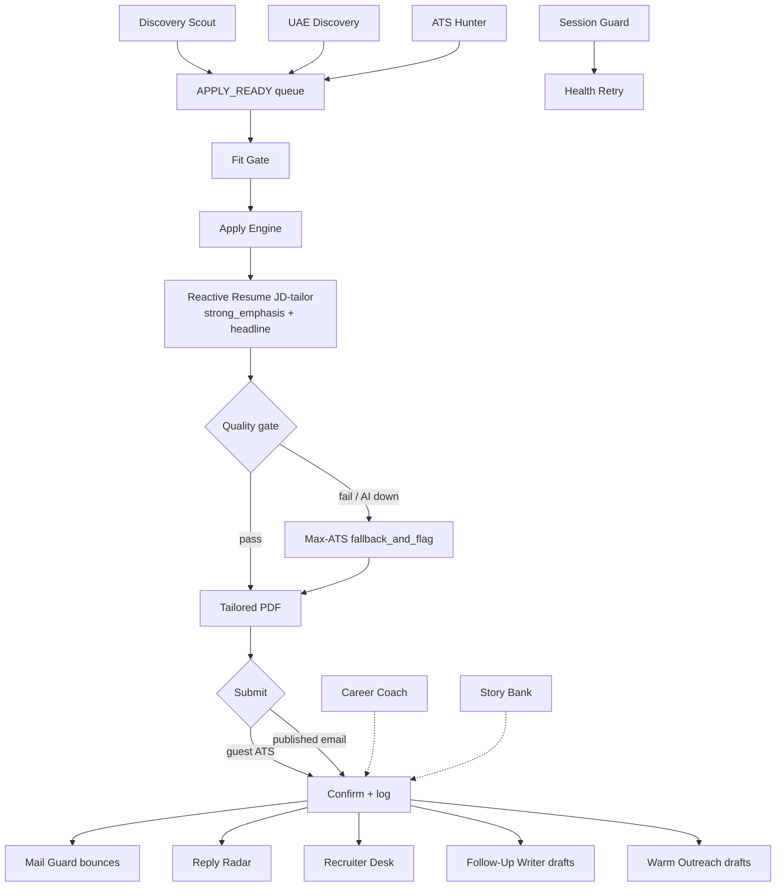

# HireMesh

**Multi-worker agentic job-search + auto-apply pipeline** for serious Cloud / Platform / AI leadership searches.

HireMesh runs fifteen independent workers that share files (queues, status, inbox). They do **not** wait on each other: each wakes on its schedule, reads the latest artifacts, does one job, writes status, and exits. Originally built as scheduled routines on the [Grok Bot](https://grok.com) desktop-assistant platform; this repo also ships Claude and ChatGPT / OpenAI Agents SDK ports.

Author: **Meet Shah** · Portfolio: [shahmeetk.github.io](https://shahmeetk.github.io) · Repo: [github.com/shahmeetk/HireMesh](https://github.com/shahmeetk/HireMesh)

## Why

Volume engines spray applications. HireMesh optimizes for **fit-first discovery**, **JD-tailored resumes**, **published-email-only outreach**, and **interview conversion** (follow-ups, warm notes, reply tracking) — with humans still clicking Send on every outbound message that isn't a confirmable ATS form.

## Flow



See also the PNG diagrams in [`docs/images/`](docs/images/).

## Workers (15)

| Bot | Purpose | Schedule (Asia/Dubai) | Reads | Writes | Mode |
|-----|---------|----------------------|-------|--------|------|
| **Discovery Scout** | Free-API + portal discovery; rank fit/geo into APPLY_READY | :11 every 2h | excludes, SALARY_POLICY, portals | queues/SCOUT_QUEUE.json, queues/APPLY_READY.json, status/MESH_STATUS.json | discover-only |
| **UAE Discovery** | Daytime Bayt/GulfTalent/GCC careers → APPLY_READY lane=uae | 08:56–16:56 / 2h | excludes, lane_router | queues/APPLY_READY.json (lane=uae) | discover-only |
| **ATS Hunter** | Guest Greenhouse/Lever/Workable/Ashby closer | :41 every 2h | APPLY_READY (guest_ats first), APPLIED_* | status/HUNTER_RESULTS.json, APPLIED_* | acting (guest ATS) |
| **Fit Gate** | Local BM25+seniority+lane re-rank; drop weak rows | :18 every 2h | SCOUT_QUEUE / APPLY_READY, FIT_GATE.json | APPLY_READY.json, status/FIT_GATE_DROPPED_LAST.json | rank-only |
| **Apply Engine** | JD-tailor via Reactive Resume → quality gate → ATS or published-email submit | :26 every 2h | APPLY_READY, EMAIL_SAFE, master resume | APPLIED_*, APPLY_LOG, tailored PDFs, TAILOR_FALLBACK_RETRY.jsonl | acting (ATS/email) |
| **Mail Guard** | Bounce harvest + published hiring-email verify | 08:56 / 14:56 / 20:56 | Gmail DSNs, careers pages | status/BOUNCES.json, queues/EMAIL_SAFE.json | verify-only |
| **Recruiter Desk** | Inbound recruiter triage → reply drafts | weekdays 09:26 / 13:26 / 17:26 | Gmail recruiter threads | inbox/RECRUITER_DRAFTS.md | draft-only |
| **Career Coach** | Weekly quality/quantity + conversion digest | Mondays 08:26 | APPLY_LOG, FUNNEL, blockers | status/WEEKLY_COACH.md | read-only |
| **Follow-Up Writer** | D+3/D+7/D+14 nudge drafts after applies | daily 10:53 | APPLY_LOG, FUNNEL | inbox/FOLLOWUPS.md | draft-only |
| **Warm Outreach** | HM/recruiter note drafts for strong fits | weekdays 12:26 | APPLY_LOG, APPLY_READY | inbox/WARM_PATH.md | draft-only |
| **Reply Radar** | Gmail replies → FUNNEL stages; alert on screens | 11:53 / 16:53 / 20:53 | Gmail | status/FUNNEL.json | classify-only |
| **Story Bank** | Weekly STAR bank refresh from resume + JD themes | Sundays 18:26 | master resume, recent JDs | status/STORY_BANK.md | prep-only |
| **Session Guard** | Probe Gmail, LinkedIn, Reactive Resume AI | 08:36 / 14:36 / 20:36 | sessions / RXRESU | status/SESSION_GUARD.json, HEALTH_RETRY_NEEDED.json | health-only |
| **Reactive Resume AI Watch** | Probe Reactive Resume AI; write RXRESU_AI_STATUS.json | folded into Session Guard (optional standalone) | RXRESU API | status/RXRESU_AI_STATUS.json | health-only |
| **Health Retry** | Dense rechecks until Session Guard is healthy; then idle | :23/:53 08–21 (only when unhealthy) | HEALTH_RETRY_NEEDED.json | status/HEALTH_RETRY_LAST.json | health-only |

## Key design rules

1. **Lane routing** — UAE-based **or** fully remote, never both as one target. Daytime (≈08:00–17:59 local) prioritizes UAE; evening/night prioritizes fully remote. Soft-geo EMEA remote = remote lane.
2. **Fit-first** — Fit Gate demotes weak inquiry spam before Apply Engine spends a cycle.
3. **Never re-apply** the same company or URL (`APPLIED_COMPANIES.txt` / `APPLIED_URLS.txt`).
4. **Published hiring emails only** — Mail Guard verifies; never invent `hello@` / `careers@`.
5. **Never auto-send replies** — Follow-Up Writer, Warm Outreach, and Recruiter Desk are draft-only.
6. **Blockers go to a backlog** — CAPTCHA / SSO / pixel issues are logged; Scout/Engine/Hunter keep moving.
7. **Health checks at set hours** — Session Guard at 08:36 / 14:36 / 20:36; Health Retry densifies only while unhealthy.

## Quick Start

### Grok Bot
1. Copy `platforms/grokbot/skills/` into your skills library and `platforms/grokbot/routines/` as scheduled routines.
2. Set `HIREMESH_HOME` to a writable workspace folder; copy `config/*.example.*` → live config; fill `.env`.
3. Enable schedules (Asia/Dubai examples in each routine). See [`platforms/grokbot/README.md`](platforms/grokbot/README.md).

### Claude
1. Copy `platforms/claude/.claude/` into your project; install Agent Skills under `platforms/claude/skills/`.
2. Connect filesystem + browser (e.g. Playwright MCP) + Gmail MCP.
3. Schedule with `claude -p` + cron/launchd. See [`platforms/claude/README.md`](platforms/claude/README.md).

### ChatGPT / OpenAI
1. Custom GPT: paste `platforms/chatgpt/custom-gpt/instructions.md` (under 8k chars) and attach knowledge files listed there.
2. Or run `platforms/chatgpt/agents-sdk/` with `openai-agents` + cron. See [`platforms/chatgpt/agents-sdk/README.md`](platforms/chatgpt/agents-sdk/README.md).

### Plain cron + Python
```bash
export HIREMESH_HOME=/path/to/hiremesh-data
cp -r config examples "$HIREMESH_HOME/"
pip install -r requirements.txt   # stdlib-only for most scripts; urllib only
python scripts/job_scout_hire_mesh.py
python scripts/fit_gate_hire_mesh.py
python scripts/jd_tailor_resume.py --company Acme --role "Platform Lead" --jd-file jd.txt
```

## Repo layout

```
HireMesh/
├── README.md
├── docs/               architecture, getting-started, jd-tailoring, bots/*, images/
├── platforms/
│   ├── grokbot/        original routines + skills (reconstructed)
│   ├── claude/         subagents, Agent Skills, slash commands
│   └── chatgpt/        Custom GPT instructions + Agents SDK example
├── scripts/            Python helpers (env-based paths, no secrets)
├── config/             example candidate / roles / lanes / excludes
├── examples/           fake JSON artifacts
├── .env.example
└── LICENSE             MIT
```

## Safety & ethics

- Respect site Terms of Service and robots.txt; prefer public APIs over brittle scrapers.
- Rate-limit discovery; identify your bot via a real contact User-Agent.
- **Human-in-the-loop for sends** — drafts for email/LinkedIn; only confirmable guest ATS forms may auto-submit.
- No credential harvesting, no CAPTCHA farming services, no paid spam scrapers as hard dependencies.
- Keep `.env`, ledgers, and PDFs out of git (see `.gitignore`).

## License

MIT © 2026 Meet Shah
