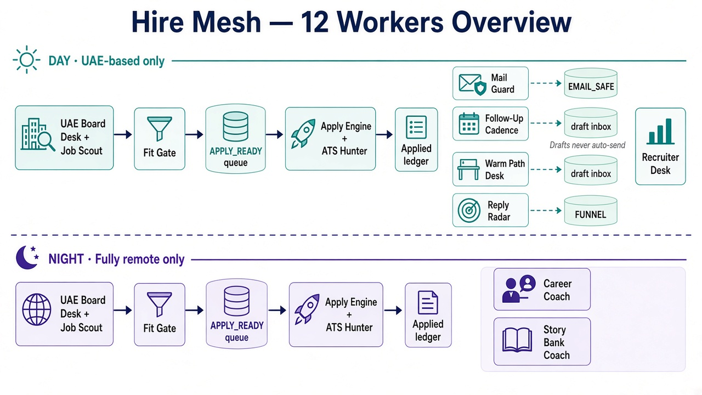
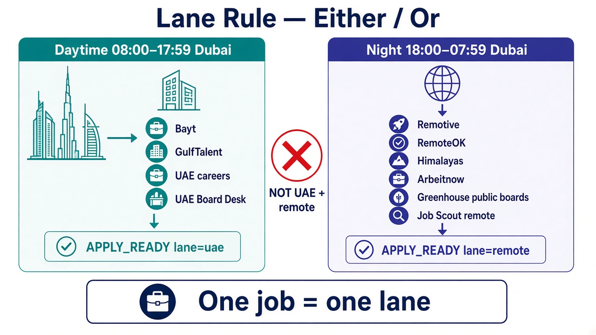
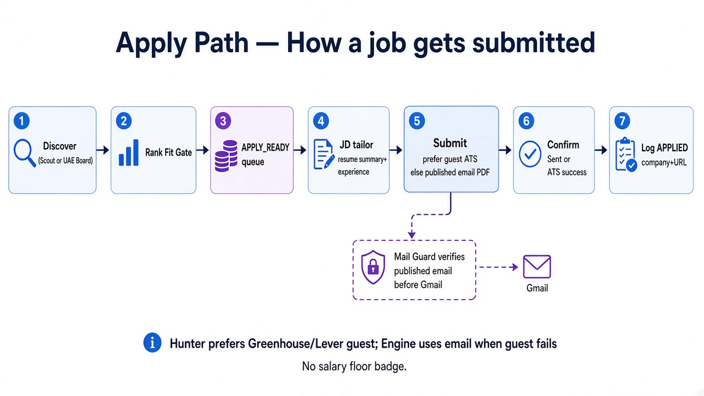
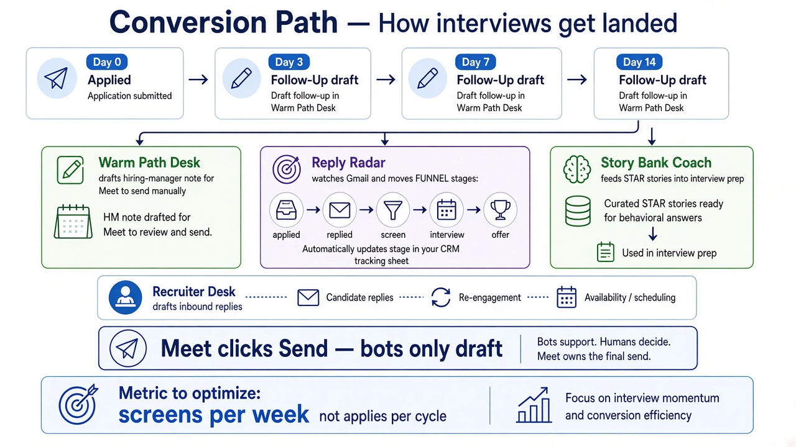
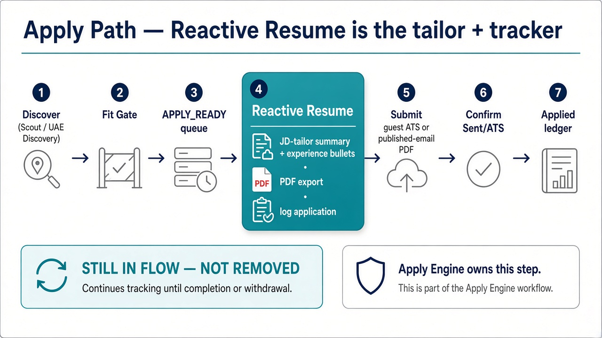

# Architecture

HireMesh is a **shared-filesystem multi-worker** system. Workers are scheduled independently and coordinate only through files under `$HIREMESH_HOME`.

## Shared files

| Artifact | Path | Writer(s) | Readers |
|----------|------|-----------|---------|
| Scout queue | `queues/SCOUT_QUEUE.json` | Discovery Scout | Fit Gate |
| Apply-ready | `queues/APPLY_READY.json` | Scout, UAE Discovery, Fit Gate | Apply Engine, ATS Hunter, Warm Outreach |
| Email-safe | `queues/EMAIL_SAFE.json` | Mail Guard | Apply Engine |
| Applied ledger | `APPLIED_COMPANIES.txt`, `APPLIED_URLS.txt` | Engine, Hunter | everyone (dedupe) |
| Fit config | `status/FIT_GATE.json` | human / Coach | Fit Gate |
| Mesh heartbeat | `status/MESH_STATUS.json` | every worker | status dashboards |
| Funnel | `status/FUNNEL.json` | Reply Radar, Follow-Up Writer | Career Coach |
| Bounces | `status/BOUNCES.json` | Mail Guard | Engine |
| Session health | `status/SESSION_GUARD.json` | Session Guard | Health Retry |
| AI probe | `status/RXRESU_AI_STATUS.json` | Reactive Resume AI Watch | Session Guard, Engine |
| Tailor retry log | `status/TAILOR_FALLBACK_RETRY.jsonl` | Apply Engine | Coach / human |
| Follow-ups | `inbox/FOLLOWUPS.md` | Follow-Up Writer | human |
| Warm path | `inbox/WARM_PATH.md` | Warm Outreach | human |
| Recruiter drafts | `inbox/RECRUITER_DRAFTS.md` | Recruiter Desk | human |
| Story bank | `status/STORY_BANK.md` | Story Bank | human |
| Weekly coach | `status/WEEKLY_COACH.md` | Career Coach | human |
| Blocker backlog | `status/BLOCKER_BACKLOG.md` | Engine / Hunter | human (async) |

## Handoff protocol

1. **Discover** — Scout (remote APIs + portals) and UAE Discovery (daytime UAE boards) append candidates.
2. **Gate** — Fit Gate re-ranks / drops; writes clean `APPLY_READY.json`.
3. **Apply** — Apply Engine JD-tailors (Reactive Resume `strong_emphasis`) and submits; ATS Hunter prefers guest ATS on the same ledger.
4. **Guard** — Mail Guard repairs bounce addresses into `EMAIL_SAFE.json`.
5. **Convert** — Reply Radar stages inbound mail; Follow-Up / Warm / Recruiter Desk draft only.
6. **Coach** — Monday digest + Sunday Story Bank.
7. **Health** — Session Guard at fixed hours; Health Retry densifies only on failure.

Workers update `status/MESH_STATUS.json` with `{worker, ts, ok, notes}` each run.

## Schedule overview (cron, Asia/Dubai example)

Timezone is configurable via `TZ` / `HIREMESH_TZ` (default `Asia/Dubai`).

| Cron (Asia/Dubai) | Worker |
|-------------------|--------|
| `11 */2 * * *` | Discovery Scout |
| `18 */2 * * *` | Fit Gate |
| `26 */2 * * *` | Apply Engine |
| `41 */2 * * *` | ATS Hunter |
| `56 8,14,20 * * *` | Mail Guard |
| `26 9,13,17 * * 1-5` | Recruiter Desk |
| `26 8 * * 1` | Career Coach |
| `56 8-16/2 * * *` | UAE Discovery |
| `53 10 * * *` | Follow-Up Writer |
| `53 11,16,20 * * *` | Reply Radar |
| `26 12 * * 1-5` | Warm Outreach |
| `26 18 * * 0` | Story Bank |
| `36 8,14,20 * * *` | Session Guard |
| `23,53 8-21 * * *` | Health Retry (no-ops when healthy) |

## Quiet unless worth surfacing

Workers stay silent when there's nothing actionable:

- Scout with zero new fit → heartbeat only.
- Reply Radar with no screen/interview → no ping.
- Session Guard healthy → no notification; Health Retry skips.
- Draft workers write files; they never spam chat unless a screen/offer appears.

## Diagrams

